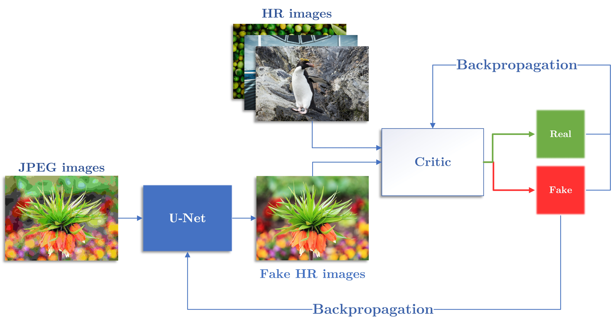
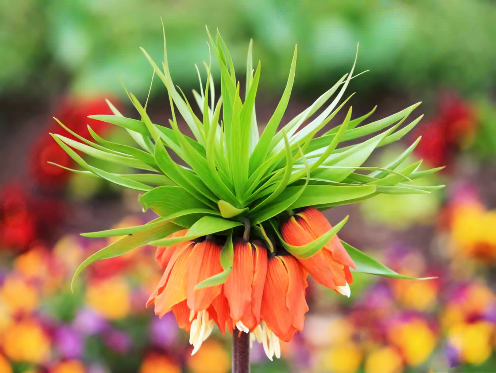
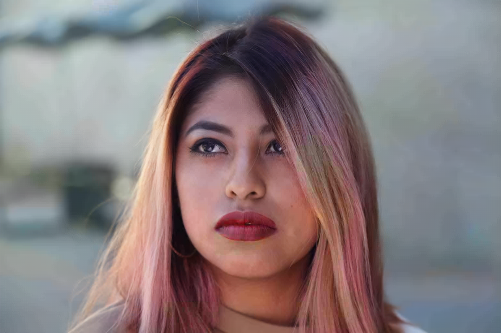

# Artifact removal GAN

In this work, we devise a neural network to remove from an image the artefacts of the most used compression format: JPEG.
The structure of the model is based on the Generative Adversarial Network (GAN) design. This particular architecture is composed of two elements that are competing with each other: the Generator and the Discriminator. 
    
U-net is used as the Generator of the model. This component takes a JPEG image as input and it outputs the same image without the artefacts.
    
To train the model we use the NoGAN technique. Thanks this method, the training of the neural network is more stable and the model can reach better results. 
    
The key feature of the development of the model is the usage of the perceptual loss function: Learned Perceptual Image Patch Similarity (LPIPS).  This function was created to mimic human vision judgements and it is used to measure the similarity between two images.

---
## Architecture

The neural net is based on the [DeOldify](https://github.com/jantic/DeOldify) model.

We used [MobileNet](https://github.com/rwightman/gen-efficientnet-pytorch) as the U-Net encoder, [LPIPS](https://github.com/richzhang/PerceptualSimilarity) as loss function and [DIV2k](https://data.vision.ee.ethz.ch/cvl/DIV2K/) as dataset.

The metrics used are:

- [SSIM](https://github.com/jorge-pessoa/pytorch-msssim)
- [LPIPS](https://github.com/richzhang/PerceptualSimilarity)
- [BRISQUE](https://github.com/bukalapak/pybrisque)
- [NIQE](http://www.scikit-video.org/stable/modules/generated/skvideo.measure.niqe.html#skvideo.measure.niqe)

---
## Results

### Original:

### GAN:

### Crop
<table>
  <tr>
      <td><b>JPEG</b></td>
     <td><b>GAN</b></td>
  </tr>
  <tr>
    <td></td>
    <td></td>
  </tr>
 </table>

### Original:

### GAN:

<table>
  <tr>
      <td><b>JPEG</b></td>
     <td><b>GAN</b></td>
  </tr>
  <tr>
    <td></td>
    <td></td>
  </tr>
 </table>

## Comparison to the ground truth
<table>
  <tr>
      <td><b>High resolution</b></td>
      <td><b>JPEG</b></td>
     <td><b>GAN</b></td>
  </tr>
  <tr>
    <td></td>
    <td></td>
    <td></td>
  </tr>
 </table>
 
 ## Video Demo

   

